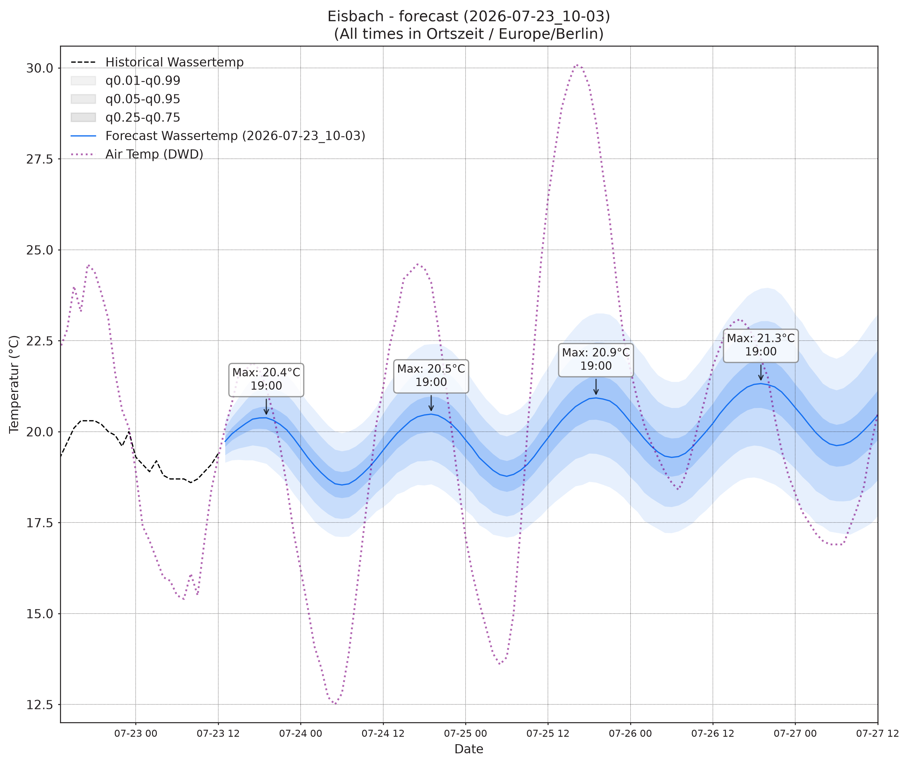

# Eisbach Forecast

A 96-hour probabilistic forecast of the water temperature of the Eisbach in Munich,
published as a plot and a quantile table twice a day.



## What it does

Every run scrapes the last 40 days of measured water temperature, pulls the DWD weather
forecast for the next 8 days, and predicts the next 96 hours as seven quantiles
(1 %, 5 %, 25 %, 50 %, 75 %, 95 %, 99 %).

| Input | Source |
| --- | --- |
| Water temperature, hourly | [GKD Bayern](https://www.gkd.bayern.de), gauge *München Himmelreichbrücke* |
| Air temperature, pressure, precipitation | [Bright Sky](https://brightsky.dev) (DWD station `03379`) |

The trick that makes a 96-hour horizon work is that the weather covariates are shifted
backwards by 96 hours before they reach the model, as `airtemp_96` and `pressure_96`. At
any timestamp the model therefore sees the weather *four days ahead* of that point, which
is exactly the known-future information a weather forecast provides. Precipitation is
fetched and archived but is **not** currently a model input.

## The model

A custom **DUET-Prob** network — a mixture of experts over linear and Echo State Network
experts, with a Student-t output head. It is not a foundation model, and despite what
earlier versions of this README claimed, it is **not** Chronos-2 or AutoGluon.

| | |
| --- | --- |
| Parameters | 2,677,319 |
| Context → horizon | 384 h (16 days) → 96 h (4 days) |
| Channels | `wassertemp`, `airtemp_96`, `pressure_96` |
| Output | Student-t distribution, sampled at 7 quantiles |

The inference code lives in `eisbach/model/`, vendored from
[`obwohl/ts_proba_cuda`](https://github.com/obwohl/ts_proba_cuda) — see
`eisbach/model/PROVENANCE.md` for the exact commit and what was stripped. The 10 MB
checkpoint is downloaded on first use and verified against a pinned SHA256.

AutoGluon / Chronos-Bolt was evaluated as the comparison arm and lost; the custom model
was better on both point accuracy (MAE 0.45 vs 0.62) and calibration (CRPS 0.311 vs
0.420) over 10 backtest windows. That comparison is **parked, not abandoned** — the code
and measurements are in `archive/`.

## Backtests, and how honest they are

The plots show the current forecast alongside backtests at −96 h, −192 h and −288 h.
Those backtests are not all of equal quality, so the archive records which kind each one
is (see `eisbach/archive.py`):

| Kind | Future covariates come from | Honest? | Reproducible? |
| --- | --- | --- | --- |
| `live` | the DWD forecast available at the time | yes | no — must be stored |
| `replay` | an archived DWD forecast snapshot | yes | only where a snapshot exists |
| `oracle` | the weather that actually occurred | **no** | always |

`live` is preferred because it is both free (already computed) and honest. `oracle` is
the last resort: it hands the model a perfect weather forecast, so it flatters the
result and must not be read as evidence of real-world skill. Historical DWD *forecasts*
are a paid product we do not have, which is why the oracle fallback exists at all.

Every archived row carries its `kind`, `covariate_source`, `model_id` and `code_version`,
so a stored forecast can always be attributed to the code and checkpoint that produced it.

## Outputs

| File | Contents |
| --- | --- |
| `Prediction.png` | The forecast, with history and air temperature |
| `Prediction_Backtest.png` | The same, plus the three backtests |
| `Prediction.csv` | The forecast as quantiles, in local time |
| `data/archive/forecasts/YYYY-MM.csv` | Every forecast ever made, with provenance |
| `data/archive/weather/YYYY-MM.csv` | DWD forecasts as issued, enabling `replay` |
| `data/archive/observations/YYYY-MM.csv` | Measured values, so verification needs no re-scrape |

## Running it

```bash
pip install -e ".[dev]"
python main.py
```

The checkpoint downloads automatically on first run (~10 MB, cached in `data/model/`).
Inference is CPU-only and the whole pipeline takes well under a minute.

```bash
pytest          # unit tests, no network access required
ruff check .
```

## Layout

```
main.py                 pipeline entrypoint
eisbach/data.py         scraping, weather fetch, feature construction
eisbach/inference.py    forecast and backtest orchestration
eisbach/archive.py      provenance-tracked storage
eisbach/plotting.py     matplotlib output
eisbach/model/          vendored DUET-Prob inference code
tests/                  unit tests
archive/                unmaintained research code, kept for the record only
docs/                   operational notes
TODO.md                 audit findings and the cleanup plan
```
